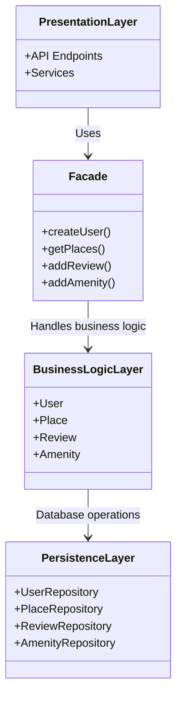

# HBnB – High-Level Architecture Diagram

# TASK 0

   ## Overview
    This document presents a high-level package diagram of the HBnB application. The diagram illustrates a three-layer 
    architecture and demonstrates how these layers communicate using the Facade design pattern.
    
    The goal is to provide a clear and structured view of how the system is organized and how its components interact.
    
---
    
   ## Architecture Overview
    The HBnB application follows a **layered architecture** composed of three main layers:
    1. Presentation Layer
    2. Business Logic Layer
    3. Persistence Layer
    Each layer has a specific responsibility and communicates with others in a controlled and organized manner.
    
---
    
   ## Layer Descriptions
    
   ### 1. Presentation Layer
    This is the layer that users directly interact with. It includes: API endpoints and Services. When a user sends a request 
    (for example, creating a user or viewing places), it first comes to this layer. The layer then forwards the request to the 
    system through the Facade, acting as the main entry point.
    
   ### 2. Business Logic Layer
    This is the “brain” of the application.This layer decides what should happen in the system. It includes:User, Place, Review,
    Amenity
    
    Here, all the important work happens:
    1. Business rules are applied
    2. Data is validated
    3. Application behavior is controlled
    
   ### 3. Persistence Layer
    This layer handles data storage.It communicates directly with the database and ensures everything is stored correctly.
    It includes: Repository classes (e.g., UserRepository, PlaceRepository)
    
    Its job is simple:
    1. Save data to the database
    2. Retrieve data when needed
    
---
    
    
   ### Facade Pattern
    
    The Facade pattern makes communication between layers much simpler. Instead of the Presentation Layer directly 
    talking to the Business Logic Layer, everything goes through the Facade.
    
    Think of the Facade as a middleman that:
    1. Receives requests
    2. Knows where to send them
    3. Hides internal complexity
    
   ### Benefits:
    Provides a single entry point
    Keeps the system simple and clean
    Improves readability and maintainability
    Reduces tight coupling between layers
    
   ### 🔄 Communication Flow
    The user sends a request to the Presentation Layer
    The request is forwarded to the Facade
    The Facade calls the Business Logic Layer
    The Business Logic Layer interacts with the Persistence Layer
    The result is returned back to the user through the same path

## 📊 Package Diagram

